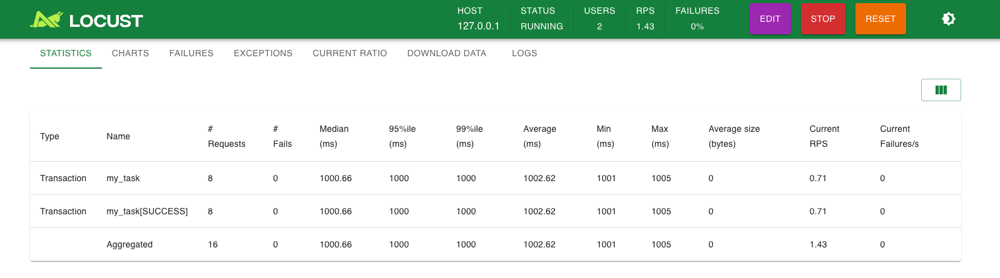
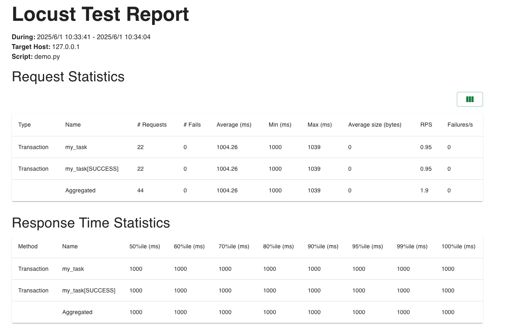
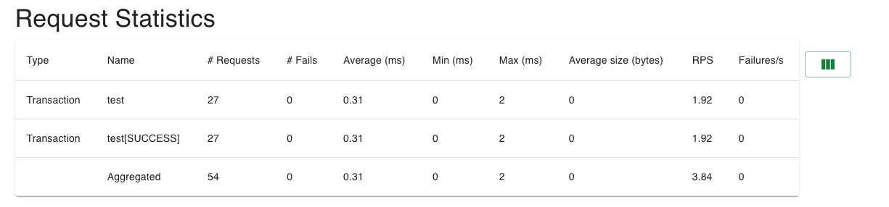

# locust_framework

> **说明**：本仓库为个人作品，因历史原因以 fork 形式存在于当前账号下，代码与内容均由本人（LeeJackWho）独立开发与维护，早期版本发布于个人旧账号ljxpython。
基于 [Locust](https://locust.io/) 二次封装的压测框架，补齐集合点、事务统计、优雅停机、告警通知等真实压测场景需要的能力。


## 目录

- [框架能力](#框架能力)
- [框架结构](#框架结构)
- [自定义参数](#自定义参数如何使用)
- [运行方式](#运行方式)（无 UI / Web UI / 无头）
- [分布式压测](#如何分布式压测)
- [自定义场景](#自定义场景编写)
- [自定义事务统计](#自定义事务统计)
- [自定义压测策略](#自定义压测策略)
- [集合点](#集合点如何使用)
- [压测报告](#压测报告优化)
- [测试数据编排](#测试数据的动态获取及编排可支持分布式的资源编排)
- [嵌入第三方平台](#支持嵌入第三方测试平台使用)

---

## 框架能力

> 基于locust框架进行二次开发:https://locust.io/
>
> 主要封装完善功能如下:
>
> 1. 集合点
> 2. 自定义事务
> 3. 自定义参数
> 4. 测试数据的动态获取及编排(可支持分布式的资源编排)
> 5. 压测报告优化
> 6. 优雅的停止压测
> 7. 第三方调用(该框架已经接入到作者自己开发的测试平台中)
> 8. 自动告警(支持邮件\飞书\钉钉群等消息上报)
> 9. 一些其他小的优化项


## 框架结构

文件结构如下：
```bash
.
├── README.md
├── conf
│   ├── config.py
│   ├── constants.py
│   ├── settings.local.yaml
│   └── settings.yaml
├── docs
│   └── pics
│       └── img.png
├── locustfiles
│   ├── demo.py
│   ├── shape_classes
│   │   └── __init__.py
│   ├── test.py
│   ├── test_demo
│   │   └── test_good.py
│   └── test_user
│       ├── __init__.py
│       ├── __pycache__
│       │   └── test_user.cpython-312.pyc
│       └── test_user.py
├── logs
│   └── test.log
├── main.py
├── poetry.lock
├── pyproject.toml
├── reports
├── requirements.txt
├── src
│   ├── client
│   │   ├── __init__.py
│   │   └── demo_client
│   │       ├── flask_auth.py
│   │       ├── flask_client.py
│   │       └── response.py
│   ├── model
│   │   ├── __init__.py
│   │   ├── __pycache__
│   │   │   ├── locust_test.cpython-312.pyc
│   │   │   └── modelsbase.cpython-312.pyc
│   │   ├── auto_pytest.py
│   │   ├── locust_test.py
│   │   └── modelsbase.py
│   └── utils
│       ├── __init__.py
│       ├── file_operation.py
│       ├── locust_report.py
│       ├── log_moudle.py
│       ├── rendezvous.py
│       ├── robot.py
│       └── util.py
├── stop_locust.py
└── stop_locust.sh


```


## 自定义参数如何使用

1. 封装测试框架,支持指定轮数`loop_num`后自动停止压测
2. 支持使用集合点且自定义集合数`rendezvous_num`
3. 支持其他业务相关参数通过web/终端传入


### 在压测文件内定义自定义参数

```
@events.init_command_line_parser.add_listener
def _(parser):
    parser.add_argument("--product_id", type=str, env_var="product_id", default="1925511528732168192", help="测试业务")
    parser.add_argument("--node_num", type=int, env_var="node_num", default=1, help="测试的node数量")
    parser.add_argument("--pod_num", type=int, env_var="pod_num", default=1, help="测试的pod数量")
    parser.add_argument("--loop_num", type=int, env_var="loop_num", default=1, help="执行的轮数")
    parser.add_argument("--is_rendezvous",  type=str_to_bool,default=False, help="是否使用集合点")
    parser.add_argument("--rendezvous_num", type=int, env_var="rendezvous_num", default=1, help="集合点的数量")
```

### 如何在压测任务中调用

使用`self.environment.parsed_options.xxxx` 的方式调用

```
class WebsiteUser(HttpUser):
    host = "127.0.0.1"
    @task
    def my_task(self):
        global num
        num += 1
        time.sleep(1)
        loop_num = self.environment.parsed_options.loop_num
        # 集合点
        if self.environment.parsed_options.is_rendezvous:
            with self.environment.shared:
                print('业务逻辑')
        # 当达到指定轮数后停止
        if loop_num < num:
            self.environment.runner.quit()  # 强制停止所有虚拟用户
```


### 无UI方式调用

- make方式执行

```
make run  script=locustfiles/xxxx.py u=2 r=1 is_rendezvous=false loop_num=10
```

- locust原生方式执行

```
locust -f locustfiles/cubelinux/xxxx.py --headless \
                --product_id 0 \
                --loop_num 10 \
                --rendezvous_num 0 \
                --is_rendezvous false \
                --csv=logs/xxx \
                --html=logs/locustfiles/xxxx.html \
                -u 2 -r 1 -t 5m -s 100

```


### UI方式调用

- make方式执行

```
make run-web  script=locustfiles/xxxx.py u=2 r=1 is_rendezvous=false loop_num=10
```

- locust原生方式执行

```
locust -f locustfiles/cubelinux/xxxx.py  \
                -u 2 -r 1 -t 5m -s 100

```


前端选择参数


## web UI 方式压测

可以在web页面选择压测场景的及其权重

可以在web页面选择自定义变量


- make方式执行

```
make run-web  script=locustfiles/xxxx.py u=2 r=1 is_rendezvous=false loop_num=10
```

- locust原生方式执行

```
locust -f locustfiles/cubelinux/xxxx.py  \
                -u 2 -r 1 -t 5m -s 100

```


## 无头方式压测

压测权重需预先标注,通过`--xxx xxx`的方式填写自定义变量

- make方式执行

```
make run  script=locustfiles/xxxx.py u=2 r=1 is_rendezvous=false loop_num=10
```

- locust原生方式执行

```
locust -f locustfiles/cubelinux/xxxx.py --headless \
                --product_id 0 \
                --loop_num 10 \
                --rendezvous_num 0 \
                --is_rendezvous false \
                --csv=logs/xxx \
                --html=logs/locustfiles/xxxx.html \
                -u 2 -r 1 -t 5m -s 100

```


## 如何分布式压测

当压测的量级比较大时,一台开发机或者单线程不能满足需求,就需要多线程多开发机配合了,这方面locust天然支持,就不需要我进行二次封装了,方式如下:

### 启动master节点

这一步是必须的,之后让其他的woker节点加入

```
locust -f locustfile.py --master
```


### woker节点加入

`processes ` 参数代表开启的进程数

```
# 同一服务器加入
 locust -f - --worker --processes 4
# 其他开发机
locust -f - --worker --processes 1  --master-host 127.0.0.1
```


这里只提到了如何运行分布式压测,但是对于分布式压测变量如何管理,数据如何分配,因为篇幅太长,我并没有做介绍,感兴趣的可以查阅我博客的相关章节

## 自定义场景编写

不需要考虑并发应该如何设计,只需要考虑单个user的代码逻辑编排,可以像接口测试一样,只关注接口的参数化\接口间关联传参\断言的处理

接口一般有同步接口和异步接口,对于异步接口,封装了轮训功能,可以定期轮训查询异步完成的功能

断言部分,支持常用的接口状态断言,响应结果断言,熟悉断言使用的方法后,可大大减轻脚本编写工作者的开发时间


## 自定义事务统计

```
from src.utils.locust_report import manual_report, measure

class WebsiteUser(HttpUser):
    host = "127.0.0.1"

    @task
    def my_task(self):
        with manual_report("my_task"):
            time.sleep(1)
        # 如果使用measure,需自定义实现开始及结束时间及exception
        measure(name="order", start_time=start_time,end_time=status['time'],exception=LocustError(f"host_id: {host} 订购失败"))

```

统计结果如下



HTML报告统计结果相同:







## 自定义压测策略

有时候我们希望的压测的模型不是先升然后平稳的运行,而是升降突然拉升等等一些模型的设计,在`locustfiles/shape_classes`目录下,封装几种场景的场景,也可以基于该场景进行二次开发

如何调用:在脚本中继承`locustfiles/shape_classes`下的相关类,在传参时加入`--class-picker`参数来选择要使用的形状即可


## 集合点如何使用

集合点:当需要指定事务同时执行时,需要使用集合点的功能,locust本身未提供需使用协程的信号量进行二次封装,支持参数指定或者动态指定集合数在集合点并发执行事务的功能

如下是一个简单的demo

```
from util.rendezvous import Rendezvous


@events.test_start.add_listener
def init_shared_service(environment, **kwargs):
    # 仅在Master节点或独立运行模式初始化
    if not isinstance(environment.runner, WorkerRunner):
        environment.shared = Rendezvous(environment.parsed_options.rendezvous_num)

class WebsiteUser(HttpUser):
    host = "127.0.0.1"
    @task
    def my_task(self):
        global num
        num += 1
        time.sleep(1)
        loop_num = self.environment.parsed_options.loop_num
        # 集合点
        if self.environment.parsed_options.is_rendezvous:
            with self.environment.shared:
                print('业务逻辑')
        # 当达到指定轮数后停止
        if loop_num < num:
            self.environment.runner.quit()  # 强制停止所有虚拟用户
```


## 压测报告优化

如果使用make方式执行,则在测试完成或者终止后,自动生成报告,也支持自动上传到云存储服务器中

测试报告的格式如下:


如果第三方接入,实现`main.py`中的`run_test()`方式,则测试报告格式如下:


## 测试数据的动态获取及编排(可支持分布式的资源编排)

这里说一下思路: 复杂的可以使用中间件,类似于Redis这些进行资源管理,简单的可以使用locust的原生`send_message`方法实现

既支持csv文件指定,也支持测试时,在前置准备环境生成测试数据,且动态分配给指定的user使用


## 其他使用方式

- 支持飞书\钉钉\邮箱等消息告警
- client优化
- log封装优化

该框架是基于locust进行的二次开发,使其变得更加好用

我在这里想说的,这只是一个工具,能帮助我们更好的完成性能测试,除了工具外,我认为更重要的还是,如何进行场景的设计及指标的设定,需求明确,才能把真正的风险暴露出来.

关于如何开展性能测试,感兴趣的小伙伴可以参考我的文章:性能测试那二三事


## 支持嵌入第三方测试平台使用

实现`main.py`中的`run_test()`方式即可

目前作者已经相关该框架嵌入到了自己的自动化测试平台中:https://www.coder-ljx.cn:7524/locust/locustcaselist


## locust 使用经验

请查阅作者博客的相关章节,里面总结了我在工作中各种场景下,使用locust进行压测的经验总结,希望能帮到你


也欢迎和您交流讨论😊

个人微信号


